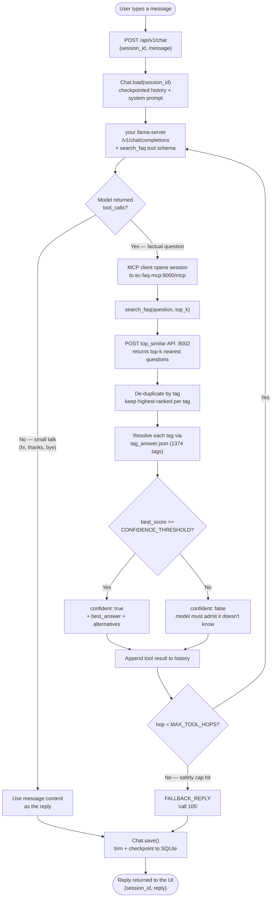

# EC FAQ Chatbot (llama.cpp + FastMCP + FastAPI)

A context-aware Bengali FAQ chatbot for Bangladesh Election Commission
NID/voter services. Two containers, one `docker compose up`, plus a
llama-server you already have running:

1. **your llama-server** — this repo does not run llama.cpp itself. Point
   `LLAMA_BASE_URL` at any OpenAI-compatible llama-server you already have
   running, on this host or elsewhere on the network.
2. **`ec-faq-mcp`** — a real MCP server built with
   [FastMCP](https://gofastmcp.com), exposing one tool, `search_faq`, that
   bridges to your existing `top_similar` embedding-search API and resolves
   results to answers via `tag_answer.json`.
3. **`src/api` + `src/chatbot`** — a FastAPI backend with per-session conversation memory
   and an OpenAI-style tool-calling loop, plus a static HTML/JS page to test
   the bot live in your browser.

```
 Browser ──▶ ec-faq-chatbot (FastAPI, :8000)
             - session memory (per session_id)
             - tool-calling loop
                  │
                  │ OpenAI-compatible /v1/chat/completions
                  ▼
             your llama-server (bring your own, e.g. :8080)
             - runs your GGUF model
                  │
                  │ model requests the search_faq tool
                  ▼
             ec-faq-mcp (FastMCP, Streamable HTTP, internal :9000/mcp)
             - search_faq tool
                  │
                  │ POST /ec_bot/top_similar/
                  ▼
             your existing top_similar API (:8002)
                  │
             tag -> tag_answer.json (bundled in src/mcp/)
```

## How it decides what to say

1. User sends a message via the static chat UI (or any HTTP client) to the
   chatbot's `/api/v1/chat` endpoint.
2. The chatbot calls your llama-server with the full conversation
   history plus one tool definition: `search_faq`.
3. **If the model thinks the question needs a lookup** (NID fees, voter
   registration, corrections, etc.), it calls `search_faq`. The MCP server:
   - queries your `top_similar` API for the top-k nearest questions,
   - deduplicates results by `tag`,
   - resolves each unique tag to its answer via `tag_answer.json`,
   - returns the best answer + confidence + alternatives.
4. The model reads the tool result and replies, grounded in the retrieved
   answer. If confidence is low, it says it doesn't know and points the
   user to `105`.
5. **If the message is just small talk** ("hi", "thanks", "bye"), the model
   answers directly without calling the tool.
6. The full exchange (including tool calls) is kept in that session's
   history, so follow-up questions retain context.

### The same flow as a chart



## Streaming

`POST /api/v1/chat` still returns one JSON reply, but the UI uses
`POST /api/v1/chat/stream`, which returns Server-Sent Events so nothing waits
on the full answer. A tool-backed reply takes ~9s end to end; with streaming
the first thinking token lands in well under a second.

Each SSE frame is `data: {json}`, terminated by `data: [DONE]`:

| `type` | meaning |
|---|---|
| `start` | carries the `session_id` for this turn |
| `reasoning` | a chunk of the model thinking out loud (**not** part of the reply) |
| `tool_call` | the model invoked a tool — `name` + `arguments` |
| `tool_result` | condensed result: `confident`, `best_tag`, `best_score`, `threshold`, `candidates[]` |
| `token` | a chunk of the actual answer |
| `done` | the fully assembled `reply` |
| `error` | something failed mid-turn |

`reasoning` is streamed separately because llama-server emits it as a
non-standard `reasoning_content` delta. Keeping it out of `content` is what
lets the UI show thinking in a collapsible block without polluting the answer
or the stored history.

### Live tool-call view

The UI renders each `tool_call` as a chip showing the tool name and arguments
with a spinner, then fills in the `tool_result` underneath — confident vs low
confidence, the matched tag, the score against the active threshold, and the
other candidates. Thinking auto-collapses as soon as the first answer token
arrives.

### Retrieval parameters

The parameter panel sends a `params` object with every request. `top_k` is
forwarded to the `top_similar` API; the rest are implemented in
`search_faq` (`src/mcp/server.py`), since the upstream API accepts only
`question` and `top_k`:

| param | effect |
|---|---|
| `top_k` | how many nearest neighbours to retrieve before tag de-duplication |
| `min_score` | per-request override of `CONFIDENCE_THRESHOLD` |
| `min_score_ratio` | required margin: best must score `>= runner_up * ratio` to count as confident. `1.0` demands no margin |
| `handle_unknown` | when not confident, replace the answer with the explicit "call 105" text instead of a probably-wrong one |
| `show_candidates` | include the `alternatives` list in the result |

`min_score_ratio` and `handle_unknown` had no prior definition anywhere in
the stack — the semantics above are the ones I implemented. If your other
bot defines them differently, this is the place to reconcile.

## Repo layout

```
ec-faq-chatbot/
├── main.py                   # entrypoint: `python main.py api` | `python main.py mcp`
├── docker-compose.yml
├── .env.example
├── pyproject.toml            # single dependency/build definition for both services
├── api.Dockerfile            # chatbot image: FastAPI + OpenAI SDK
├── mcp.Dockerfile            # MCP server image
├── static/
│   ├── index.html            # chat UI shell
│   ├── style.css             # UI styles
│   └── app.js                # SSE streaming client, live tool-call view
└── src/
    ├── core/                 # shared by every service
    │   ├── config.py         # typed Settings: chatbot_settings, mcp_settings
    │   └── logger.py         # get_logger() / configure_logging(), LOG_LEVEL
    ├── api/                  # every FastAPI import lives in here
    │   ├── app.py            # create_app(): static mount, /health, v1 router
    │   └── v1/               # versioned HTTP layer, served under /api/v1
    │       ├── routes.py     # POST /chat, /chat/stream (SSE), /reset
    │       └── schemas.py    # request/response models
    ├── chatbot/              # domain logic, no web framework
    │   ├── chat.py           # Chat: one conversation, the tool-calling loop
    │   ├── checkpointer.py   # SqliteCheckpointer: transcripts + idle expiry
    │   ├── client.py         # OpenAIClient (llama-server) + McpClient (search_faq)
    │   ├── prompt.py         # system prompt and canned replies (Bengali text)
    │   └── tools.py          # tool catalogue, dispatch, result summary
    └── mcp/                  # MCP container
        ├── server.py         # FastMCP tool: search_faq (+ health)
        └── tag_answer.json   # local fallback (live copy pulled from GitHub)
```

## Configuration

Every environment variable is declared, typed, and validated in one place
per service, using `pydantic-settings`:

- `mcp_settings` in `src/core/config.py` — `top_similar_api_url`, `top_similar_timeout`,
  `tag_answer_path`, `confidence_threshold`, `mcp_transport`, `mcp_host`,
  `mcp_port`, `mcp_path`.
- `chatbot_settings` in `src/core/config.py` — `llama_base_url`, `llama_model`, `mcp_server_url`,
  `max_history_turns`, `max_tool_hops`, `api_host`, `api_port`.

Both classes read from process environment variables first (matching
`docker-compose.yml`), falling back to a local `.env` file for standalone
runs outside Docker, then to the defaults shown in `src/core/config.py`. Field
names map to env vars case-insensitively (`top_similar_api_url` ↔
`TOP_SIMILAR_API_URL`), so you never need to touch the Python to change a
setting — just edit `.env` or `docker-compose.yml`.

## Before you run this

**1. Have a llama-server already running.**
This repo does not run llama.cpp — it expects an OpenAI-compatible
`llama-server` reachable at `LLAMA_BASE_URL`, on this host or elsewhere on
the network. It must serve a tool-calling-capable model (Qwen2.5-Instruct,
Llama-3.1/3.2-Instruct, Hermes-2-Pro, Gemma with `--jinja`, etc.) and must
have been started **with `--jinja`** — without it `llama-server` never emits
`tool_calls`, and the bot silently answers from the model instead of your
FAQ data. `LLAMA_BASE_URL` defaults to `http://host.docker.internal:8080/v1`,
i.e. one published on this host; override it for a llama-server elsewhere.

**2. ~~Verify the `top_similar` endpoint path.~~ Verified.**
`TOP_SIMILAR_API_URL=http://172.31.60.228:8002/ec_bot/top_similar/` is
correct. A POST there returns `200` with exactly the shape `search_faq`
expects (`input_question`, `top_similar[].tag`, `.cosine_similarity`).
No action needed.

**3. `GITHUB_TOKEN` is required.**
The MCP server fetches `tag_answer.json` **live from GitHub at startup**
(`TAG_ANSWER_URL`, default: the `development` branch of
`Synesis-IT-PLC/ec-faq-bot`). That repo is **private** — verified: the raw URL
returns `404` with no token and `200` with one. Set `GITHUB_TOKEN` to a PAT
with read access, or the fetch fails and the server silently falls back to the
bundled copy. With a valid token the server logs `fetched 1374 tags` on boot.

`src/mcp/tag_answer.json` is a snapshot of that dataset, used only when the
live fetch fails. Set `TAG_ANSWER_ALLOW_LOCAL_FALLBACK=false` to fail startup
loudly instead of serving a possibly stale snapshot. The knowledge base is read
once at start, so a dataset change needs a
`docker compose restart ec-faq-mcp`.

### Gotchas found while bringing this up

- **The MCP healthcheck must use `initialize`, not `ping`.** MCP Streamable
  HTTP requires the `initialize` handshake before any other method, so a
  bare `ping` returns `400` forever and the container never goes healthy —
  which blocks `ec-faq-chatbot` via `depends_on`. Fixed in `docker-compose.yml`.
- **A second llama.cpp on the same GPU competes with the first.** If you
  are tempted to run your own here as well as the one already on the host,
  don't — two models load into the same VRAM and one, or both, will OOM.
  Point `LLAMA_BASE_URL` at the existing one instead.

## Running it

```bash
cp .env.example .env
# edit .env: set LLAMA_BASE_URL to your llama-server, fix TOP_SIMILAR_API_URL
# if needed, and GITHUB_TOKEN for the private knowledge-base repo

docker compose up --build
```

Both containers start through the same root entrypoint — `python main.py api`
for the chatbot and `python main.py mcp` for the MCP server.

Dependencies run one way: `api -> chatbot -> core`. FastAPI is imported only
under `src/api/`, so the chat engine and clients in `src/chatbot/` can be
used, or tested, without a web server involved.

The chatbot won't accept traffic until `ec-faq-mcp` reports healthy
(`depends_on: service_healthy`); llama-server readiness is not gated by
compose, since it is not a container this repo manages. If it isn't
reachable yet, chat requests fail over to the "call 105" fallback reply
until it is.

Only the chat UI is published on the host. The MCP server stays on the
compose network, so nothing unauthenticated is exposed there:

- **Chat UI**: `http://localhost:${PORT}/static/index.html` (PORT default 8000)
- **API docs**: `http://localhost:${PORT}/docs` (Swagger UI; `/redoc` and
  `/openapi.json` are served too)
- **Health check**: `http://localhost:${PORT}/health`
- `http://localhost:${PORT}/` redirects to the chat UI
- **MCP server** — internal only, as `ec-faq-mcp:9000/mcp`

To inspect the MCP server while debugging, go in through a container rather
than publishing a port:

```bash
docker compose exec ec-faq-chatbot curl -s http://ec-faq-mcp:9000/mcp
```

## Testing the MCP tool directly (without the chatbot or llama.cpp)

The MCP server is not published on the host, so call it from inside the
compose network:

```bash
docker compose up -d ec-faq-mcp
docker compose exec ec-faq-chatbot python - <<'PY'
import asyncio, json
from fastmcp import Client

async def main():
    async with Client("http://ec-faq-mcp:9000/mcp") as client:
        print("Tools:", [t.name for t in await client.list_tools()])
        result = await client.call_tool("search_faq", {"question": "hi", "top_k": 10})
        print(json.dumps(result.data, ensure_ascii=False, indent=2))

asyncio.run(main())
PY
```

## Using the MCP server from Claude Desktop / Claude Code instead

`src/mcp/server.py` also supports stdio transport, so you can run it
directly as a local MCP server (outside Docker) for other MCP clients:

```bash
pip install ".[mcp]"
MCP_TRANSPORT=stdio TOP_SIMILAR_API_URL=http://172.31.60.228:8002/ec_bot/top_similar/ python main.py mcp
```

Claude Desktop config (`claude_desktop_config.json`):

```json
{
  "mcpServers": {
    "ec-faq-search": {
      "command": "python",
      "args": ["main.py", "mcp"],
      "cwd": "/absolute/path/to/ec-faq-chatbot",
      "env": {
        "MCP_TRANSPORT": "stdio",
        "TOP_SIMILAR_API_URL": "http://172.31.60.228:8002/ec_bot/top_similar/"
      }
    }
  }
}
```

## Notable design choices / limitations

- **Transcripts are checkpointed to SQLite** (`src/chatbot/checkpointer.py`)
  in the `chat-sessions` volume, so a restart mid-conversation does not lose
  context. This is durability, not horizontal scale: one container against
  one file is fine, but several replicas sharing it over a volume is fragile
  and across hosts does not work at all. That needs Redis or Postgres behind
  the same interface.
- **Conversations are cleared once they end.** HTTP gives no end-of-chat
  signal, so "ended" means idle: a background sweeper deletes transcripts
  untouched for `SESSION_TTL_MINUTES` (default 60), checked every
  `SESSION_SWEEP_MINUTES`. Set the TTL to 0 to keep transcripts until the
  user resets explicitly. This also bounds what the database retains, which
  matters because these transcripts contain citizens' questions.
- **History trimming** is turn-count based (`MAX_HISTORY_TURNS`), not
  token-based. If your model's context window is small and answers are
  long, lower this value in `.env`.
- **Confidence threshold**: answers with `cosine_similarity` below
  `CONFIDENCE_THRESHOLD` (default `0.55`) are flagged as unreliable — the
  system prompt tells the model to admit it doesn't know rather than guess.
  Tune this after testing against real questions.
- **No auth on any service.** If you deploy this beyond localhost/LAN
  testing, put a reverse proxy (nginx/Caddy) with auth in front of ports
  `8000`, `8080`, and `9000` — none of these services authenticate requests
  on their own.
