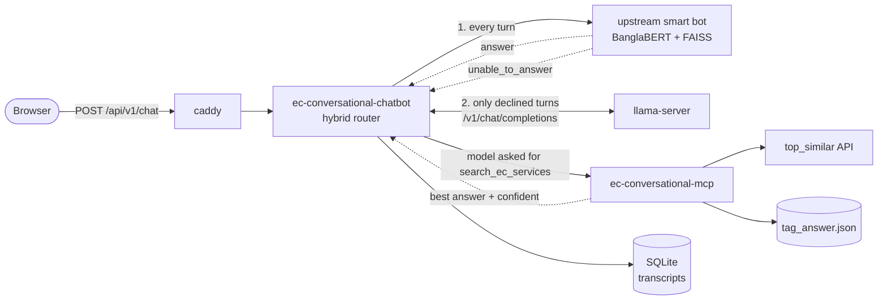

# EC Conversational Chatbot

A context-aware Bengali FAQ chatbot for Bangladesh Election Commission
NID/voter services. It answers from your FAQ dataset, not from the model's
memory: an MCP tool retrieves the closest matching question and the model
replies grounded in that answer — or admits it doesn't know and points the user
to `105`.

It is **hybrid**: every turn goes first to the upstream EC smart bot
(BanglaBERT + FAISS over the curated dataset), which answers it verbatim. Only
a question that API declines reaches the local LLM. See
[The hybrid path](#the-hybrid-path).

llama.cpp + FastMCP + FastAPI. Two containers, one `docker compose up`, plus a
llama-server you already have running.

## Quick start

**Prerequisites**

- **A running llama-server** at `LLAMA_BASE_URL` (this repo doesn't run
  llama.cpp). Needs a tool-calling model (Qwen2.5-Instruct, Llama-3.1/3.2,
  Hermes-2-Pro, Gemma) started **with `--jinja`** — without it no `tool_calls`
  are emitted and the bot silently answers from the model instead of your data.
  Add **`--reasoning off`** too; it cuts turn time from ~31s to ~13s
  ([details](#performance)). Don't run a second llama.cpp on the same GPU — both
  will fight for VRAM.
- **A `GITHUB_TOKEN`** — a PAT with read access to the private knowledge-base
  repo. `tag_answer.json` is fetched from `TAG_ANSWER_URL` at startup; a valid
  token logs `fetched 1374 tags` on boot.

- **A `top_similar` endpoint** — `TOP_SIMILAR_API_URL`, the embedding search
  the `search_ec_services` tool queries. It must return `top_similar` entries
  carrying `tag` and `cosine_similarity`; those two fields are all the tool
  reads.

**Run**

```bash
cp .env.example .env      # set LLAMA_BASE_URL, GITHUB_TOKEN
docker compose up --build
```

| | URL |
|---|---|
| Chat UI | `http://localhost:${PORT}/static/index.html` (PORT default 9100) |
| API docs | `http://localhost:${PORT}/docs` |
| Health | `http://localhost:${PORT}/health` |
| MCP server | internal only — `ec-conversational-mcp:9000/mcp` |

Both containers share one entrypoint: `python main.py api` / `python main.py
mcp`. The chatbot waits for `ec-conversational-mcp` to report healthy; llama-server isn't
gated by compose, so until it's up chat requests return the "call 105" fallback.

## How it works

| Component | Port | Role |
|---|---|---|
| **`caddy`** | `${PORT}` → `:80` | The only port published on the host; proxies `/llamacpp/*` and `/ec-llm-service/*` to their upstreams, everything else to the chatbot |
| **`ec-conversational-chatbot`** | `:8000` internal | FastAPI: session memory, hybrid routing, the tool-calling loop, static chat UI |
| **upstream smart bot** | `SMART_BOT_URL` | BanglaBERT + FAISS over the curated dataset; answers first, declines to the LLM |
| **`ec-conversational-mcp`** | `:9000` internal | [FastMCP](https://gofastmcp.com) server exposing one tool, `search_ec_services` |
| **your llama-server** | `:8080` | Runs your GGUF model, serves `/v1/chat/completions` |
| **your `top_similar` API** | `TOP_SIMILAR_API_URL` | Embedding search over the FAQ; returns nearest questions with `tag` and `cosine_similarity` |



### The hybrid path

Set `SMART_BOT_URL` and every turn is put to `POST {SMART_BOT_URL}/ec_bot/smart/`
before anything else happens. That API answers out of the curated dataset word
for word, which is what you want for NID guidance — fees, ages and deadlines
reach the citizen exactly as the dataset has them, with no model in the path to
paraphrase them.

`LIST_OF_TAGS_WILL_GO_TO_LLM` decides which answers the LLM writes instead:

```
LIST_OF_TAGS_WILL_GO_TO_LLM=["greetings", "salam_dao", "goodbye", "unable_to_answer"]
```

`unable_to_answer` is the API saying it has none. The greeting and farewell
tags are there because the dataset answers hello and goodbye with one fixed
line each, which reads as canned to someone making small talk, and nothing
about small talk needs the verbatim guarantee the dataset exists to provide.
The list is exhaustive — take a tag out and it is served from the dataset
again. A failed or unreachable call counts as a decline too, so the bot keeps
answering while the smart service is down instead of returning an error.
Leave `SMART_BOT_URL` empty and there is no hybrid at all: every turn goes to
the LLM, exactly as before.

**Both transcripts are kept.** The smart API is stateful in a
pass-the-transcript way — it returns a `messages` string it expects back on the
next turn, carrying the per-turn tag its follow-up handling reads — so that
string is checkpointed verbatim in its own `smart_messages` column. A
smart-answered turn is *also* mirrored into the LLM transcript as a plain
user/assistant exchange, so when a later question does fall through, the model
inherits everything the citizen has already been told rather than starting
mid-thread.

In the UI a smart lookup renders as an ordinary tool chip: matched tag and
score on a hit, a low-confidence warning on a decline followed by the LLM
stream. `POST /api/v1/chat` reports which engine answered in `source`
(`"smart"` or `"llm"`), and the `done` SSE frame carries the same field.

Both also carry `tag` — the knowledge-base entry the answer came from, empty
when the LLM wrote it. The browser hands it back on the matching `/api/v1/tts`
call and the route forwards it to the TTS service, which **caches a tagged
reply and declines to cache an untagged one**. That split is the point: a
canned answer is read verbatim to every citizen who asks it, while an LLM
answer is new wording every time and would only evict the ones that repeat.

**The chatbot orchestrates, not the model.** llama-server never talks to the
MCP server: it only *asks* for `search_ec_services` in a `tool_calls` response, and
`src/chatbot/chat.py` executes the call, appends the result to the transcript,
and calls llama-server again — up to `MAX_TOOL_HOPS` times.

The model decides whether a question needs a lookup. If it does, `search_ec_services`
queries `top_similar`, de-duplicates by `tag`, resolves each tag to its answer,
and returns the best one with a confidence flag and alternatives. Below
`CONFIDENCE_THRESHOLD` the system prompt tells the model to admit it doesn't
know. Small talk skips the tool. Everything, tool calls included, stays in the
session history so follow-ups keep context.

## API

| Endpoint | Purpose |
|---|---|
| `POST /api/v1/chat` | One JSON request, one JSON reply |
| `POST /api/v1/chat/stream` | The same turn as SSE — the UI uses this |
| `POST /api/v1/reset` | Clear a session's transcript |

**SSE frames** are `data: {json}`, terminated by `data: [DONE]`:

| `type` | Payload |
|---|---|
| `start` | `session_id` for this turn |
| `reasoning` | Model thinking out loud — **not** part of the reply |
| `tool_call` | `name` + `arguments` |
| `tool_result` | `confident`, `best_tag`, `best_score`, `threshold`, `candidates[]` |
| `token` | A chunk of the answer |
| `done` | The assembled `reply`, plus `source` (`smart` or `llm`) and `tag` |
| `error` | Something failed mid-turn |

`reasoning` is separate because llama-server emits it as a non-standard
`reasoning_content` delta; keeping it out of `content` lets the UI show thinking
in a collapsible block without polluting the answer or the stored history. The
UI renders each tool call as a chip with its arguments, result, matched tag and
score, and shows total turn time under each answer.

**Voice input**: the UI records with `MediaRecorder` and posts to
`/api/v1/asr`, which the app forwards to `ASR_TTS_URL`, so the browser only
talks to this stack's own origin.

**Load testing**: `ab`/`wrk` can't measure the SSE endpoint (they see one
long-lived response). Use `scripts/load_test.py`:

```bash
python scripts/load_test.py --url http://YOUR_HOST:9100 \
    --concurrency 10 --requests 50 --message "NID কার্ডের ফি কত?"
```

### Pre-rendering the answers

The dataset is fixed — one canned answer per tag — so the bot says the same few
hundred sentences over and over, and synthesising them live costs **5 to 34
seconds** each. The TTS service caches its own output (it answers `x-cache:
HIT`), so the job here is to fill that cache once:

```bash
python scripts/generate_audio.py --warm            # ask it to say every answer once
python scripts/generate_audio.py --warm --limit 10 # a sample first
```

Measured against the warmed service:

| | cold | cached |
|---|---|---|
| `/tts` buffered | 33,650 ms | 263 ms |
| PCM stream, first byte | 4,683 ms | 16 ms |
| voice mode, first sound | — | 39 ms (in Chrome) |

**One call per distinct text is enough.** The service keys on the text and the
voice, not the output format — warming `wav` makes the PCM stream a hit too, so
both the buffered path a typed turn uses and the stream voice mode uses are
covered by a single request. The dataset's 1379 tags share only **892 distinct
answers**, and `--warm` sends only those. Re-running is all cache hits, so an
interrupted pass just resumes and a dataset edit costs only what changed.

What gets sent is not the dataset entry. Two things happen to an answer first,
and both live here rather than in the TTS service:

- the smart bot appends a constant closing line to every answer it serves;
- `transform.for_speech` rewrites it for a voice — `২৩০` becomes `দুইশ ত্রিশ`,
  `NID` becomes `এনআইডি`, markdown goes.

`POST /api/v1/tts` sends the service exactly that string, so the warm pass has
to send the same one, character for character. `--manifest-only` writes those
strings out (`spoken`, per tag) without synthesising anything, so the match can
be checked rather than assumed.

Without `--warm` the script writes the audio here instead, one file per tag
under `./audio` — for auditioning a voice or handing the clips to someone, not
for serving. That path needs `ffmpeg` for the default MP3 output; `--format
wav` skips the encode.

### Retrieval parameters

The UI sends a `params` object per request. `top_k` is forwarded to
`top_similar`; the rest are implemented in `search_ec_services`
(`src/mcp/server.py`), since the upstream API accepts only `question` and
`top_k`.

| Param | Effect |
|---|---|
| `top_k` | Neighbours to retrieve before tag de-duplication |
| `min_score` | Per-request override of `CONFIDENCE_THRESHOLD` |
| `min_score_ratio` | Best must score `>= runner_up * ratio` to count as confident; `1.0` demands no margin |
| `handle_unknown` | When not confident, return the explicit "call 105" text instead of a probably-wrong answer |
| `show_candidates` | Include `alternatives` in the result |

## Configuration

Every variable is typed and validated in `src/core/config.py`
(`chatbot_settings`, `mcp_settings`) via `pydantic-settings`. Process env wins,
then `.env`, then the defaults in that file. Names map case-insensitively
(`top_similar_api_url` ↔ `TOP_SIMILAR_API_URL`), so no Python edits are needed
to change a setting. `.env.example` documents the full list; the ones you'll
actually touch:

No host, endpoint or credential has a default in the code — anything that
identifies a deployment lives only in `.env`, and the service refuses to start
if a required one is missing.

| Variable | Default | Purpose |
|---|---|---|
| `LLAMA_BASE_URL` | **required** | Your llama-server |
| `SMART_BOT_URL` | *(unset)* | Upstream smart bot; set it to enable the hybrid path, empty = LLM only |
| `SMART_BOT_TIMEOUT` | `60` | Seconds to wait for one smart-bot turn |
| `SMART_BOT_USE_LLM_SELECTOR` | `true` | Let the smart bot's selector arbitrate — and decline, which is what hands a turn to the LLM |
| `LIST_OF_TAGS_WILL_GO_TO_LLM` | `["greetings", "salam_dao", "goodbye", "unable_to_answer"]` | The answers the LLM writes instead of the smart bot |
| `TOP_SIMILAR_API_URL` | **required** | Embedding search API |
| `TAG_ANSWER_URL` | **required** | Knowledge-base dataset |
| `LLAMA_UPSTREAM`, `EC_LLM_UPSTREAM` | **required with `caddy`** | Upstreams Caddy publishes |
| `GITHUB_TOKEN` | *(unset)* | PAT for the knowledge-base repo |
| `CONFIDENCE_THRESHOLD` | `0.55` | Below this cosine score, admit uncertainty |
| `MAX_HISTORY_TURNS` | `12` | Past turns kept per session (turn-count, not tokens) |
| `SESSION_TTL_MINUTES` | `60` | Idle timeout before a transcript is deleted; `0` disables. Backstop for a chat that never said goodbye |
| `TRACE_TTL_DAYS` | `7` | Days a trace recording is kept; `0` keeps forever |
| `TAG_ANSWER_REFRESH_SECONDS` | `43200` | Re-fetch interval; `0` = once at startup |
| `CORS_ALLOW_ORIGINS` | `*` | Tighten once the UI's origin is known |
| `PORT` | `9100` | The only port published on the host |
| `ASR_TTS_URL` | _(required for voice)_ | Speech service for both ASR and TTS |

`src/mcp/tag_answer.json` is a snapshot used only if the live fetch fails; set
`TAG_ANSWER_ALLOW_LOCAL_FALLBACK=false` to fail startup loudly instead.

## Repo layout

```
├── main.py                 # `python main.py api` | `python main.py mcp`
├── Caddyfile               # /llamacpp/*, /ec-llm-service/* → upstreams, rest → chatbot
├── vercel.json             # build step for hosting the static UI
├── scripts/                # load_test.py, generate_audio.py, point-alias.sh
├── static/                 # the chat UI, served as-is (no build step)
│   ├── index.html          # markup only: links css/, loads js/main.js
│   ├── css/                # base, chat, composer, responsive, answer, voice
│   └── js/                 # ES modules, entry point main.js
└── src/
    ├── core/               # config.py (typed Settings), logger.py
    ├── api/                # the only place FastAPI is imported
    │   ├── app.py          # create_app(): static mount, /health, v1 router
    │   ├── trace.py        # per-turn record on disk (off unless TRACE_DIR)
    │   └── v1/             # routes.py (/chat, /chat/stream, /reset), schemas.py
    ├── chatbot/            # the conversation, no web framework
    │   ├── chat.py         # one conversation: smart-first routing, tool loop
    │   ├── smart.py        # upstream smart bot; decides what falls to the LLM
    │   ├── checkpointer.py # SqliteCheckpointer: both transcripts + idle expiry
    │   ├── client.py       # OpenAIClient (llama-server) + McpClient
    │   ├── prompt.py       # system prompt and canned replies (Bengali)
    │   ├── sanitize.py     # keeps the tool name out of every reply
    │   └── tools.py        # tool catalogue, dispatch, result summary
    ├── speech/             # the voice path; a typed turn touches none of it
    │   ├── asr.py          # audio up, transcript back
    │   ├── tts.py          # text down, audio back
    │   └── transform/      # a reply rewritten into something the voice can say
    │       ├── markup.py       # markdown out
    │       ├── addresses.py    # URLs said as names, paths dropped
    │       ├── numbers.py      # digits as quantities, dictation or ordinals
    │       ├── latin.py        # English rendered, spelt, or removed
    │       └── punctuation.py  # the marks a voice can say
    └── mcp/                # server.py (search_ec_services) + tag_answer.json fallback
```

Dependencies run one way: `api → {chatbot, speech} → core`. FastAPI is imported
only under `src/api/`, so `src/chatbot/` and `src/speech/` can be used or tested
without a web server. `chatbot` and `speech` do not import each other.

## Hosting the UI separately (Vercel)

`static/` is plain files with no build step, so it can be deployed on its own
while the backend keeps running wherever it is. Three requirements:

1. **HTTPS backend.** An HTTPS page can't call an HTTP API. Caddy fronts the
   chatbot; an optional `ngrok` service tunnels it without a domain:

   ```bash
   docker compose --profile public up -d     # needs NGROK_AUTHTOKEN in .env
   ```

   It's a separate profile so a plain `docker compose up` never needs an ngrok
   account.

   Set `NGROK_DOMAIN` to a reserved domain (free accounts get one, from
   https://dashboard.ngrok.com/domains) and the URL survives restarts. Without
   it the tunnel is ephemeral and every restart hands out a new URL, which
   means redoing step 2 each time. Read the current one back with:

   ```bash
   curl -s http://localhost:4040/api/tunnels | python3 -c \
     "import sys,json; print(json.load(sys.stdin)['tunnels'][0]['public_url'])"
   ```

2. **`API_BASE` must point at that URL.** `static/js/config.js` defaults it to
   `''` (same-origin), which this repo's own deployment needs. `vercel.json`
   patches that line at build time from an `NGROK_URL` env var set in the Vercel
   project, so the tunnel URL never lands in the repo. With a reserved domain
   this is set once; with an ephemeral tunnel it has to be re-pointed and
   redeployed on every restart.

3. **CORS**: `CORS_ALLOW_ORIGINS=https://your-project.vercel.app`.

The Vercel project is connected to this repo, so a push to `main` deploys and
re-points `ec-conversational-chatbot-sit12.vercel.app` automatically.

The canonical URL, **`ec-chatbot.vercel.app`**, cannot auto-update: it is the
default subdomain of a project outside this team, so it can be aliased but not
registered as a project domain (`vercel domains add` fails with
`alias_conflict`). `.github/workflows/point-alias.yml` re-points it on every
successful production deployment, so this is handled — it needs a
`VERCEL_TOKEN` repo secret with access to the `sit12` team. Run
`scripts/point-alias.sh` by hand if you ever need to force it.

## Using the MCP server on its own

The MCP server isn't published on the host, so call it from inside the network:

```bash
docker compose exec ec-conversational-chatbot python - <<'PY'
import asyncio, json
from fastmcp import Client

async def main():
    async with Client("http://ec-conversational-mcp:9000/mcp") as client:
        print("Tools:", [t.name for t in await client.list_tools()])
        result = await client.call_tool("search_ec_services", {"question": "hi", "top_k": 10})
        print(json.dumps(result.data, ensure_ascii=False, indent=2))

asyncio.run(main())
PY
```

`src/mcp/server.py` also speaks stdio, so it runs as a local MCP server for
Claude Desktop / Claude Code — `pip install ".[mcp]"`, then set
`MCP_TRANSPORT=stdio` and `TOP_SIMILAR_API_URL` in the client's server config
with `command: python`, `args: ["main.py", "mcp"]`.

## Performance

A tool-backed turn pauses for several seconds after the tool result, then
streams fast. It isn't prefill (0.11s) or the MCP round trip (1.06s) — it's the
model running a **second reasoning pass** (9.07s, 258 chunks), re-narrating the
tool result to itself. Reasoning models pay this on every hop.

**Fix: start llama-server with `--reasoning off`.** Over the same four
questions, same build, same machine:

| | Tool called | Bengali reply | Avg turn |
|---|---|---|---|
| Reasoning on | 4/4 | 4/4 | 30.9s |
| `--reasoning off` | 4/4 | 4/4 | **13.3s** |

No quality loss appeared; on the hardest case it was 4.5× faster *and* better.
Caveat: four questions is not a benchmark. `LLAMA_REASONING_EFFORT` forwards
`reasoning_effort` per request as a softer alternative, but proved unreliable
through the streaming path (247, 101 and 0 reasoning chunks across three
identical runs) — the server flag is the dependable lever.

## Limitations

- **SQLite checkpointing** (`chat-sessions` volume) survives restarts, but it's
  durability, not scale — replicas sharing one file over a volume is fragile,
  and across hosts it doesn't work. That needs Redis or Postgres behind the same
  interface.
- **Closing the chat deletes it, best-effort.** The UI holds the session id in
  the tab (not `localStorage`) and posts `/reset` on `pagehide` with a
  `keepalive` fetch, so shutting the tab removes the transcript server-side and
  reopening starts a fresh conversation. A crash or a killed tab sends nothing,
  which is what `SESSION_TTL_MINUTES` is the backstop for — HTTP gives no
  reliable end-of-chat signal, so idleness still has to cover the gap. Both
  paths delete the smart transcript along with the LLM one; the smart API keeps
  no server-side copy of its own.
- **No auth on any service.** Beyond localhost/LAN, put an authenticating
  reverse proxy in front of `8000`, `8080` and `9000`.

## Troubleshooting

| Symptom | Cause |
|---|---|
| Answers ignore your FAQ data | llama-server started without `--jinja`, so no `tool_calls` |
| MCP never healthy, chatbot won't start | Healthcheck must use `initialize`, not `ping` — already fixed in `docker-compose.yml` |
| Logs fall back to the bundled `tag_answer.json` | `GITHUB_TOKEN` missing or lacking read access |
| Every reply takes ~30s | Reasoning is on — restart with `--reasoning off` |
| llama-server OOMs | A second llama.cpp competing for the same VRAM |
| Replies are always the "call 105" fallback | llama-server unreachable at `LLAMA_BASE_URL` |
| Vercel UI can't reach the backend | Mixed content, stale `NGROK_URL`, or `CORS_ALLOW_ORIGINS` too tight |
