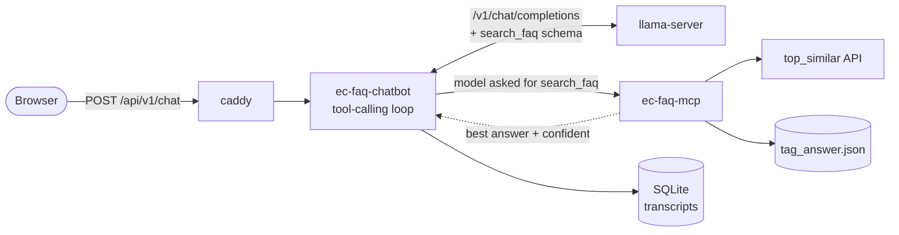

# EC Conversational Chatbot

A context-aware Bengali FAQ chatbot for Bangladesh Election Commission
NID/voter services. It answers from your FAQ dataset, not from the model's
memory: an MCP tool retrieves the closest matching question and the model
replies grounded in that answer — or admits it doesn't know and points the user
to `105`.

llama.cpp + FastMCP + FastAPI. Two containers, one `docker compose up`, plus a
llama-server you already have running.

## Quick start

**Prerequisites**

- **A running llama-server** at `LLAMA_BASE_URL` (this repo doesn't run
  llama.cpp). Needs a tool-calling model (Qwen2.5-Instruct, Llama-3.1/3.2,
  Hermes-2-Pro, Gemma) started **with `--jinja`** — without it no `tool_calls`
  are emitted and the bot silently answers from the model instead of your data.
  Add **`--reasoning off`** too; it cuts turn time from ~31s to ~13s
  ([details](#performance)). Don't run a second llama.cpp on the same GPU — both
  will fight for VRAM.
- **A `GITHUB_TOKEN`** — a PAT with read access to the private knowledge-base
  repo. `tag_answer.json` is fetched from `TAG_ANSWER_URL` at startup; a valid
  token logs `fetched 1374 tags` on boot.
- **The `top_similar` embedding API**, returning `input_question` and
  `top_similar[].{tag, cosine_similarity}`.

**Run**

```bash
cp .env.example .env      # set LLAMA_BASE_URL, TOP_SIMILAR_API_URL, GITHUB_TOKEN
docker compose up --build
```

| | URL |
|---|---|
| Chat UI | `http://localhost:${PORT}/static/index.html` (PORT default 8000) |
| API docs | `http://localhost:${PORT}/docs` |
| Health | `http://localhost:${PORT}/health` |
| MCP server | internal only — `ec-faq-mcp:9000/mcp` |

Both containers share one entrypoint: `python main.py api` / `python main.py
mcp`. The chatbot waits for `ec-faq-mcp` to report healthy; llama-server isn't
gated by compose, so until it's up chat requests return the "call 105" fallback.

## How it works

| Component | Port | Role |
|---|---|---|
| **`caddy`** | `${PORT}` → `:80` | The only port published on the host; proxies `/asr*` to the ASR service, everything else to the chatbot |
| **`ec-faq-chatbot`** | `:8000` internal | FastAPI: session memory, the tool-calling loop, static chat UI |
| **`ec-faq-mcp`** | `:9000` internal | [FastMCP](https://gofastmcp.com) server exposing one tool, `search_faq` |
| **your llama-server** | `:8080` | Runs your GGUF model, serves `/v1/chat/completions` |
| **your `top_similar` API** | `:8002` | Embedding search over the FAQ questions |



**The chatbot orchestrates, not the model.** llama-server never talks to the
MCP server: it only *asks* for `search_faq` in a `tool_calls` response, and
`src/chatbot/chat.py` executes the call, appends the result to the transcript,
and calls llama-server again — up to `MAX_TOOL_HOPS` times.

The model decides whether a question needs a lookup. If it does, `search_faq`
queries `top_similar`, de-duplicates by `tag`, resolves each tag to its answer,
and returns the best one with a confidence flag and alternatives. Below
`CONFIDENCE_THRESHOLD` the system prompt tells the model to admit it doesn't
know. Small talk skips the tool. Everything, tool calls included, stays in the
session history so follow-ups keep context.

## API

| Endpoint | Purpose |
|---|---|
| `POST /api/v1/chat` | One JSON request, one JSON reply |
| `POST /api/v1/chat/stream` | The same turn as SSE — the UI uses this |
| `POST /api/v1/reset` | Clear a session's transcript |

**SSE frames** are `data: {json}`, terminated by `data: [DONE]`:

| `type` | Payload |
|---|---|
| `start` | `session_id` for this turn |
| `reasoning` | Model thinking out loud — **not** part of the reply |
| `tool_call` | `name` + `arguments` |
| `tool_result` | `confident`, `best_tag`, `best_score`, `threshold`, `candidates[]` |
| `token` | A chunk of the answer |
| `done` | The assembled `reply` |
| `error` | Something failed mid-turn |

`reasoning` is separate because llama-server emits it as a non-standard
`reasoning_content` delta; keeping it out of `content` lets the UI show thinking
in a collapsible block without polluting the answer or the stored history. The
UI renders each tool call as a chip with its arguments, result, matched tag and
score, and shows total turn time under each answer.

**Voice input**: the UI records with `MediaRecorder` and posts to `/asr/upload`;
Caddy proxies `/asr*` to `ASR_URL`, so the browser only talks to this stack's
own origin.

**Load testing**: `ab`/`wrk` can't measure the SSE endpoint (they see one
long-lived response). Use `scripts/load_test.py`:

```bash
python scripts/load_test.py --url http://172.31.60.228:9100 \
    --concurrency 10 --requests 50 --message "NID কার্ডের ফি কত?"
```

### Retrieval parameters

The UI sends a `params` object per request. `top_k` is forwarded to
`top_similar`; the rest are implemented in `search_faq`
(`src/mcp/server.py`), since the upstream API accepts only `question` and
`top_k`.

| Param | Effect |
|---|---|
| `top_k` | Neighbours to retrieve before tag de-duplication |
| `min_score` | Per-request override of `CONFIDENCE_THRESHOLD` |
| `min_score_ratio` | Best must score `>= runner_up * ratio` to count as confident; `1.0` demands no margin |
| `handle_unknown` | When not confident, return the explicit "call 105" text instead of a probably-wrong answer |
| `show_candidates` | Include `alternatives` in the result |

## Configuration

Every variable is typed and validated in `src/core/config.py`
(`chatbot_settings`, `mcp_settings`) via `pydantic-settings`. Process env wins,
then `.env`, then the defaults in that file. Names map case-insensitively
(`top_similar_api_url` ↔ `TOP_SIMILAR_API_URL`), so no Python edits are needed
to change a setting. `.env.example` documents the full list; the ones you'll
actually touch:

| Variable | Default | Purpose |
|---|---|---|
| `LLAMA_BASE_URL` | `http://host.docker.internal:8080/v1` | Your llama-server |
| `TOP_SIMILAR_API_URL` | `…:8002/ec_bot/top_similar/` | Embedding search API |
| `GITHUB_TOKEN` | *(unset)* | PAT for the knowledge-base repo |
| `CONFIDENCE_THRESHOLD` | `0.55` | Below this cosine score, admit uncertainty |
| `MAX_HISTORY_TURNS` | `12` | Past turns kept per session (turn-count, not tokens) |
| `SESSION_TTL_MINUTES` | `60` | Idle timeout before a transcript is deleted; `0` disables |
| `TAG_ANSWER_REFRESH_SECONDS` | `43200` | Re-fetch interval; `0` = once at startup |
| `CORS_ALLOW_ORIGINS` | `*` | Tighten once the UI's origin is known |
| `PORT` | `8000` | The only port published on the host |
| `ASR_URL` | `http://172.31.60.228:8000` | Speech-to-text behind `/asr*` |

`src/mcp/tag_answer.json` is a snapshot used only if the live fetch fails; set
`TAG_ANSWER_ALLOW_LOCAL_FALLBACK=false` to fail startup loudly instead.

## Repo layout

```
├── main.py               # `python main.py api` | `python main.py mcp`
├── Caddyfile             # /asr* → ASR service, rest → chatbot
├── vercel.json           # build step for hosting static/index.html
├── scripts/              # load_test.py, point-alias.sh
├── static/index.html     # chat UI: markup, styles, SSE client, one file
└── src/
    ├── core/             # config.py (typed Settings), logger.py
    ├── api/              # the only place FastAPI is imported
    │   ├── app.py        # create_app(): static mount, /health, v1 router
    │   └── v1/           # routes.py (/chat, /chat/stream, /reset), schemas.py
    ├── chatbot/          # domain logic, no web framework
    │   ├── chat.py       # one conversation, the tool-calling loop
    │   ├── checkpointer.py  # SqliteCheckpointer: transcripts + idle expiry
    │   ├── client.py     # OpenAIClient (llama-server) + McpClient
    │   ├── prompt.py     # system prompt and canned replies (Bengali)
    │   └── tools.py      # tool catalogue, dispatch, result summary
    └── mcp/              # server.py (search_faq) + tag_answer.json fallback
```

Dependencies run one way: `api → chatbot → core`. FastAPI is imported only under
`src/api/`, so `src/chatbot/` can be used or tested without a web server.

## Hosting the UI separately (Vercel)

`static/index.html` is self-contained, so it can be deployed on its own while
the backend keeps running wherever it is. Three requirements:

1. **HTTPS backend.** An HTTPS page can't call an HTTP API. Caddy fronts the
   chatbot; an optional `ngrok` service tunnels it without a domain:

   ```bash
   docker compose --profile public up -d     # needs NGROK_AUTHTOKEN in .env
   curl -s http://localhost:4040/api/tunnels | python3 -c \
     "import sys,json; print(json.load(sys.stdin)['tunnels'][0]['public_url'])"
   ```

   It's a separate profile so a plain `docker compose up` never needs an ngrok
   account. On the free tier the URL changes every restart — hence step 2.

2. **`API_BASE` must point at that URL.** The file defaults to `''`
   (same-origin), which this repo's own deployment needs. `vercel.json` patches
   that line at build time from an `NGROK_URL` env var set in the Vercel project,
   so the tunnel URL never lands in the repo. Redeploy when it changes.

3. **CORS**: `CORS_ALLOW_ORIGINS=https://your-project.vercel.app`.

The Vercel project is connected to this repo, so a push to `main` deploys and
re-points `ec-conversational-chatbot-sit12.vercel.app` automatically.

The canonical URL, **`ec-chatbot.vercel.app`**, cannot auto-update: it is the
default subdomain of a project outside this team, so it can be aliased but not
registered as a project domain (`vercel domains add` fails with
`alias_conflict`). `.github/workflows/point-alias.yml` re-points it on every
successful production deployment, so this is handled — it needs a
`VERCEL_TOKEN` repo secret with access to the `sit12` team. Run
`scripts/point-alias.sh` by hand if you ever need to force it.

## Using the MCP server on its own

The MCP server isn't published on the host, so call it from inside the network:

```bash
docker compose exec ec-faq-chatbot python - <<'PY'
import asyncio, json
from fastmcp import Client

async def main():
    async with Client("http://ec-faq-mcp:9000/mcp") as client:
        print("Tools:", [t.name for t in await client.list_tools()])
        result = await client.call_tool("search_faq", {"question": "hi", "top_k": 10})
        print(json.dumps(result.data, ensure_ascii=False, indent=2))

asyncio.run(main())
PY
```

`src/mcp/server.py` also speaks stdio, so it runs as a local MCP server for
Claude Desktop / Claude Code — `pip install ".[mcp]"`, then set
`MCP_TRANSPORT=stdio` and `TOP_SIMILAR_API_URL` in the client's server config
with `command: python`, `args: ["main.py", "mcp"]`.

## Performance

A tool-backed turn pauses for several seconds after the tool result, then
streams fast. It isn't prefill (0.11s) or the MCP round trip (1.06s) — it's the
model running a **second reasoning pass** (9.07s, 258 chunks), re-narrating the
tool result to itself. Reasoning models pay this on every hop.

**Fix: start llama-server with `--reasoning off`.** Over the same four
questions, same build, same machine:

| | Tool called | Bengali reply | Avg turn |
|---|---|---|---|
| Reasoning on | 4/4 | 4/4 | 30.9s |
| `--reasoning off` | 4/4 | 4/4 | **13.3s** |

No quality loss appeared; on the hardest case it was 4.5× faster *and* better.
Caveat: four questions is not a benchmark. `LLAMA_REASONING_EFFORT` forwards
`reasoning_effort` per request as a softer alternative, but proved unreliable
through the streaming path (247, 101 and 0 reasoning chunks across three
identical runs) — the server flag is the dependable lever.

## Limitations

- **SQLite checkpointing** (`chat-sessions` volume) survives restarts, but it's
  durability, not scale — replicas sharing one file over a volume is fragile,
  and across hosts it doesn't work. That needs Redis or Postgres behind the same
  interface.
- **Sessions expire on idle**, since HTTP gives no end-of-chat signal. This also
  bounds retention, which matters because transcripts contain citizens'
  questions.
- **No auth on any service.** Beyond localhost/LAN, put an authenticating
  reverse proxy in front of `8000`, `8080` and `9000`.

## Troubleshooting

| Symptom | Cause |
|---|---|
| Answers ignore your FAQ data | llama-server started without `--jinja`, so no `tool_calls` |
| MCP never healthy, chatbot won't start | Healthcheck must use `initialize`, not `ping` — already fixed in `docker-compose.yml` |
| Logs fall back to the bundled `tag_answer.json` | `GITHUB_TOKEN` missing or lacking read access |
| Every reply takes ~30s | Reasoning is on — restart with `--reasoning off` |
| llama-server OOMs | A second llama.cpp competing for the same VRAM |
| Replies are always the "call 105" fallback | llama-server unreachable at `LLAMA_BASE_URL` |
| Vercel UI can't reach the backend | Mixed content, stale `NGROK_URL`, or `CORS_ALLOW_ORIGINS` too tight |
