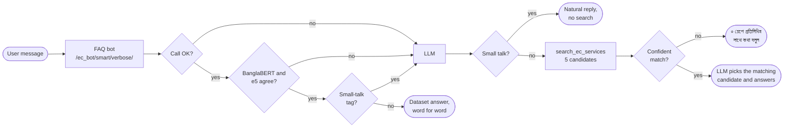

# EC Conversational Chatbot

A Bengali FAQ chatbot for Bangladesh Election Commission NID and voter
services. Answers come from the FAQ dataset, not the model's memory: the FAQ
bot answers directly when it is sure, otherwise an LLM searches the dataset and
answers from what it finds. FastAPI + FastMCP + llama.cpp.

## Quick start

Needs a running llama-server with a tool-calling model, started with
`--jinja` (no `tool_calls` without it) and `--reasoning off` (~13s per turn
instead of ~31s).

```bash
cp .env.example .env      # set LLAMA_BASE_URL, TOP_SIMILAR_API_URL, TAG_ANSWER_URL, FAQ_MODEL_URL
docker compose up --build
```

| | URL |
|---|---|
| Chat UI | `http://localhost:9100/static/index.html` |
| API docs | `http://localhost:9100/docs` |
| Health | `http://localhost:9100/health` |

## How it works

| Service | Role |
|---|---|
| `caddy` | The only published port (`PORT`, default 9100); `/asr*` to the speech service, the rest to the chatbot |
| `ec-conversational-chatbot` | FastAPI: sessions, the FAQ-bot step, the LLM tool loop, the static UI |
| `ec-conversational-mcp` | One tool, `search_ec_services`: top-similar search resolved to dataset answers |
| llama-server | The LLM (external) |
| FAQ bot | `FAQ_MODEL_URL/ec_bot/smart/verbose/` (external) |

### Who answers a turn


```mermaid
flowchart LR
    Q([User message]) --> FAQ["FAQ bot<br/>/ec_bot/smart/verbose/"]
    FAQ --> C1{"Call OK?"}
    C1 -- no --> LLM
    C1 -- yes --> C2{"BanglaBERT and<br/>e5 agree?"}
    C2 -- no --> LLM
    C2 -- yes --> C3{"Small-talk<br/>tag?"}
    C3 -- yes --> LLM
    C3 -- no --> DIRECT(["Dataset answer,<br/>word for word"])

    LLM["LLM"] --> C4{"Small talk?"}
    C4 -- yes --> SELF(["Natural reply,<br/>no search"])
    C4 -- no --> SEARCH["search_ec_services<br/>5 candidates"]
    SEARCH --> C5{"Confident<br/>match?"}
    C5 -- no --> FALLBACK(["০ চেপে প্রতিনিধির<br/>সাথে কথা বলুন"])
    C5 -- yes --> PICK(["LLM picks the matching<br/>candidate and answers"])
```

| Check | Passes when |
|---|---|
| Call OK? | `FAQ_MODEL_URL` is set and the call succeeds within `FAQ_MODEL_TIMEOUT` |
| BanglaBERT and e5 agree? | `trace.agreement.e5_bb_agreed` and `e5_bb_comparable` are both true |
| Small-talk tag? | the tag is in `LIST_OF_TAGS_WILL_GO_TO_LLM` |
| Confident match? | the top hit is above `CONFIDENCE_THRESHOLD`; small-talk tags are never offered as candidates |

On the gold set 94% of turns are answered directly. The chatbot, not the
model, runs the tool calls (`src/chatbot/chat.py`, up to `MAX_TOOL_HOPS`), and
every turn stays in the session history so follow-ups keep context.

## API

| Endpoint | Purpose |
|---|---|
| `POST /api/v1/chat` | One turn, JSON in and out |
| `POST /api/v1/chat/stream` | The same turn as SSE (used by the UI) |
| `POST /api/v1/reset` | Clear a session |
| `POST /api/v1/asr`, `/api/v1/tts` | Speech, forwarded to `ASR_TTS_URL` |

SSE frames are `data: {json}`, ending with `data: [DONE]`. Types: `start`,
`reasoning` (model thinking, not part of the reply), `tool_call`,
`tool_result`, `token`, `done` (the full `reply`), `error`.

## Configuration

Settings are typed in `src/core/config.py` and read from the environment, then
`.env`. Under Docker only the variables listed in `docker-compose.yml` reach a
container. Full list in `.env.example`.

| Variable | Default | Purpose |
|---|---|---|
| `LLAMA_BASE_URL` | required | llama-server |
| `TOP_SIMILAR_API_URL` | required | Search API used by the MCP tool |
| `TAG_ANSWER_URL` | required | Dataset answers (`GITHUB_TOKEN` for a private repo) |
| `FAQ_MODEL_URL` | empty | FAQ bot; empty sends every turn to the LLM |
| `LIST_OF_TAGS_WILL_GO_TO_LLM` | greetings, salam_dao, goodbye, unable_to_answer, fraction | Tags the FAQ bot never answers |
| `LLAMA_TEMPERATURE` | `0.2` | Low keeps the small model on its instructions |
| `CONFIDENCE_THRESHOLD` | `0.55` | Below this the bot says it doesn't know |
| `MAX_HISTORY_TURNS` | `12` | Turns kept per session |
| `SESSION_TTL_MINUTES` | `60` | Idle sessions are deleted |
| `CORS_ALLOW_ORIGINS` | `*` | Set to the UI's origin in production |

If the dataset download fails, the MCP server uses the bundled
`src/mcp/tag_answer.json`.

## Repo layout

```
main.py            python main.py api | python main.py mcp
static/            chat UI, no build step
src/core/          config, logging
src/api/           FastAPI app and routes (the only FastAPI import)
src/chatbot/       chat loop, faq.py (FAQ bot), prompt, tools, checkpointer
src/speech/        ASR, TTS and text-for-speech transforms
src/mcp/           search_ec_services
```

## Hosting the UI on Vercel

1. Expose the backend over HTTPS: `docker compose --profile public up -d`
   (ngrok; needs `NGROK_AUTHTOKEN`, and `NGROK_DOMAIN` for a URL that survives
   restarts). Use `--profile public` with `down` too, or the ngrok container
   is left behind.
2. Set `NGROK_URL` in the Vercel project; `vercel.json` writes it into
   `static/js/config.js` at build time.
3. Set `CORS_ALLOW_ORIGINS` to the Vercel URL.

A push to `main` deploys; `.github/workflows/point-alias.yml` re-points
`ec-chatbot.vercel.app` (needs a `VERCEL_TOKEN` secret).

## Troubleshooting

| Symptom | Cause |
|---|---|
| Every turn goes to the LLM | `FAQ_MODEL_URL` empty in the container; check `docker compose exec ec-conversational-chatbot env` |
| Answers ignore the dataset | llama-server started without `--jinja` |
| Every reply takes ~30s | Reasoning on; restart llama-server with `--reasoning off` |
| Always the "০ চেপে" fallback | llama-server unreachable at `LLAMA_BASE_URL` |
| Bundled `tag_answer.json` used | `GITHUB_TOKEN` missing or without access |
| Vercel UI can't reach the backend | Tunnel down, stale `NGROK_URL`, or CORS too tight |

Limits: sessions live in one SQLite file (not for multiple replicas), and no
service has authentication; put an authenticating proxy in front beyond a
trusted network.
